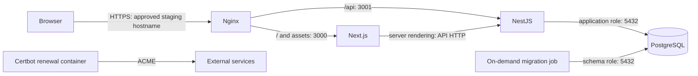

# Section 5 — Accepted demo application architecture

**2026-09-08 — Human accepted. Section 5 architecture design is closed. Acceptance covers the service boundaries, networks, storage/secrets model, staging defaults, hostname policy and containerized TLS workflow including hourly certificate checks. Implementation prerequisites below remain unverified; acceptance does not authorize deployment.** This is repository design work based on the accepted [host inventory](server.md); no server, OCI, DNS or project application repository was accessed. Public vendor documentation was consulted for technical behavior. Application capabilities, image contracts, registry access and exact dependency versions have not been inspected or verified.

## Recommended target

Use **one Compose project, `sokoladas-staging`, with four long-running services: Nginx, Next.js frontend, NestJS API and PostgreSQL**. An explicitly invoked `migrate` job reuses the API image; it is not a fifth daemon. One replica of each is sufficient for this VM. A separate long-running Certbot renewal loop handles TLS, giving five persistent containers in total; initial issuance is a one-shot invocation of the same service image. No host renewal timer is proposed. No Redis, queue, worker, mail server, object-store service or additional management layer is justified by the information available.

Next.js handles rendering and browser assets. NestJS owns business logic, authentication/session validation, database access, payment integration and any future media writes. PostgreSQL stores application state, including sessions if server-side sessions are needed. Keep business logic out of parallel Next.js API handlers; minimal server-rendering adapters may call NestJS without owning another data model. This split is justified if the proposed NestJS API exists or is intended to serve more than rendering alone. If all business operations will live in Next.js and no separate API is needed, a Next.js/PostgreSQL/Nginx layout removes an unnecessary process and deployment artifact. The separate Next.js/NestJS boundary is now accepted; the three-service alternative is retained only as an alternative considered. Application contracts must implement the accepted split.

Human decision: **`https://sokoladas.eu` is the canonical origin; `www.sokoladas.eu` permanently redirects to it**. HTTP redirects to HTTPS except the ACME HTTP-01 challenge path. DNS changes and public exposure remain Section 6 work; no current DNS state is assumed. Route `/api` and `/api/*` to `api:3001`, preserving the prefix, and all remaining application paths to `frontend:3000`. NestJS must own that prefix; Next.js handlers/auth routes must not compete for it. Browsers use relative `/api` URLs; server-side rendering uses `http://api:3001/api`. Docker DNS names are never browser URLs. The proxy terminates TLS; container HTTP is acceptable for this single-host boundary. Trust forwarded headers only from the proxy, preserve the public scheme/host, and test secure cookies, redirects and request size limits. Proposed session cookies are Secure/HttpOnly with an appropriate SameSite policy; exact auth/CSRF and payment-return behavior remain application contracts.



Arrows show intended requests, not directional Docker ACLs. Network membership permits more traffic than these arrows; the boundaries and limitations are specified below.

## Accepted Compose service model

This table defines the intended Compose attributes and application contracts; **no Compose, Dockerfile, Nginx configuration, initialization script or secret file is implemented by this task**. Exact image digests and executable health/migration commands require the application image contract before configuration can be executable.

| Service key | Image / process contract | Networks | Published host ports | Mounts / secrets | Lifecycle |
|---|---|---|---|---|---|
| `proxy` | Official stable Nginx image, exact release and ARM64 digest selected at implementation; explicit static configuration and minimal certificate-check wrapper, no discovery plugin | `edge`, `app` | Eventually IPv4 TCP 80→80 and 443→443, **only after Section 6 approval**; no UDP 443 or health port | release `proxy/nginx.conf` → `/etc/nginx/nginx.conf:ro`, release `proxy/conf.d/` → `/etc/nginx/conf.d:ro`; `letsencrypt` → `/etc/letsencrypt:ro`; `acme_webroot` → `/var/www/acme:ro`; `staging_access` secret | `unless-stopped`; loopback HTTP readiness; starts independently of upstream availability |
| `frontend` | Prebuilt project Next.js image; production standalone Node server, `HOSTNAME=0.0.0.0`, `PORT=3000`; immutable code | `app` only | None | No database/provider secrets or durable business-data volume; ephemeral `/tmp` and the image's declared Next.js cache path | `unless-stopped`, `init: true`; local HTTP readiness; starts independently and handles unavailable API |
| `api` | Prebuilt project NestJS image; production compiled server on `0.0.0.0:3001`; migrations are not part of ordinary startup | `app`, `db` | None | `db_app_password`, session-signing secret; sandbox integration secrets only if enabled; optional uploads volume only if approved | `unless-stopped`, `init: true`; `depends_on: db` with `condition: service_healthy`; API readiness includes authenticated DB query and expected schema |
| `db` | Official PostgreSQL **18 Debian target**, subject to ORM/extension compatibility; exact minor/tag and digest selected before first initialization | `db` only | None, including no localhost publishing | `pg_data` → `/var/lib/postgresql` for PG18; bootstrap/admin, app-role and migration-role password files; reviewed initialization directory read-only | `unless-stopped`; built-in `pg_isready`; use the image's normal entrypoint and permissions |
| `migrate` | Same digest as `api`, overriding command with the image's declared migration command; profile `tools`, explicitly invoked per release | `db` only | None | `db_migration_password`; no payment/session/admin password | `restart: "no"`; DB health dependency; operator/deployment sequence must require exit 0 before activating the API release |
| `certbot` | Project-maintained `certbot/certbot` image, exact ARM64-capable digest verified before adoption; webroot `certonly` for initial one-shot issuance; explicit `renew` loop for ongoing operation | `edge` only | None | `letsencrypt` → `/etc/letsencrypt` read/write; `acme_webroot` → `/var/www/acme` read/write; bounded tmpfs work/log directories | `unless-stopped` for renewal loop; one-shot issuance uses `run --rm` with loop overridden; no Docker socket or Nginx config access |

Accepted target attributes: fixed project name; explicit network membership; `platform: linux/arm64`; image references pinned by digest; no `build:` on the server; no `container_name`, host network, privileged mode, Docker socket, or host PID namespace. Frontend/API/migrate run with a fixed non-root image UID/GID (proposed 10001:10001), drop capabilities and set no-new-privileges. Use read-only application roots with narrowly scoped writable cache/tmp/media mounts, subject to testing the image's actual write paths. Do not force those user settings onto PostgreSQL's initialization entrypoint. Nginx retains its ordinary root master/non-root worker model so it can bind ports and load restricted keys; no NET_ADMIN grant. Validate selected-image entrypoint behavior with read-only configuration mounts. All services inherit the accepted Docker `local` logging policy (10m × 3, compressed); no per-service unbounded file logs.

A private internal listener does not need `expose:` to work; adding it would document the port, not restrict access. The migration profile is convenience, not a security boundary. The command must work from packaged dependencies without downloading tooling at runtime. For the first release: initialize DB/roles, wait for DB readiness, run the migration job successfully, then start API/frontend and verify the complete request path. For later releases, retain the DB and proxy while replacing selected application services. Do not rely on `depends_on` to rerun migrations for every image update.

## Networks and permitted communication

| Network key | Compose model | Members | Purpose and limits |
|---|---|---|---|
| `app` | bridge, `internal: true` | proxy, frontend, api | Proxy reaches both application services; frontend SSR reaches API. All three can communicate on shared-network listeners; this is not a one-way ACL |
| `db` | bridge, `internal: true` | db, api, migrate when invoked | PostgreSQL reachable only by API/migration among project services; proxy/frontend have no direct DB route. DB has no ordinary Internet egress |
| `edge` | bridge, not internal | proxy, certbot | Public proxy boundary and Certbot ACME connectivity. API does not join. Set proxy `gw_priority: 1` here and 0 on app |

No service joins an implicit default or shared external Docker network. Use Docker DNS service names, not fixed IPs. The public boundary is **published ports on proxy only**, not the name of a network. Frontend and API have no direct Internet egress initially: use bundled assets or local API-served media. If Next.js must fetch remote images, use external identity discovery, or call another Internet API server-side, explicitly revise its egress membership before enabling that feature.

`internal: true` does not protect data from the Docker host/root administrator, a compromised API, or an application that deliberately relays traffic across its networks. The approved purpose is capability minimization, not destination-level filtering. Do not create an outbound/egress network initially. Only when an actual payment/email/external integration is approved, introduce a dedicated ordinary `egress` bridge and attach only services that need it; do not add API to `edge` for convenience. That future bridge grants general outbound connectivity, not a provider allowlist. Internal networks cannot prevent data leaving through legitimate responses or a compromised proxy/application relay. Safe integration settings and credentials are still required. Docker's [network model](https://docs.docker.com/reference/compose-file/networks/) and [service DNS behavior](https://docs.docker.com/compose/how-tos/networking/) inform this design.

The accepted host already has Docker-managed bridge/NAT/firewall chains. **Future published-port verification remains required** across actual Docker bindings, host forwarding and effective OCI rules, including after relevant reload/reboot tests. Do not infer privacy from the host INPUT chain or from a lack of `expose:`. Proposed IPv4 TCP 80/443 publishing belongs to Section 6; no ports, IPv6 exposure or firewall rules change in this task.

## Persistent storage and disposable application containers

| Volume key | Consumer / target | Retention |
|---|---|---|
| `pg_data` | db → `/var/lib/postgresql` for PG18 | Durable DB state; stable Compose project name prevents accidentally creating a differently named empty database on a release change |
| `letsencrypt` | certbot read/write, proxy read-only → `/etc/letsencrypt` | Sensitive durable account, renewal metadata, certificate chains and private keys; mount the whole tree so live/archive symlinks resolve |
| `acme_webroot` | certbot read/write, proxy read-only → `/var/www/acme` | Stable challenge handoff path; challenge files are temporary and reconstructible, not valuable backup data |
| `uploads` (conditional) | api → `/app/uploads` | Add only if upload functionality is required. API is sole reader/writer/HTTP owner initially; no frontend/proxy filesystem share |

These are Compose named volumes on the accepted Docker storage location, not separate OCI disks. No anonymous DB volumes, no host application source mounts, and no release-specific volume names. PostgreSQL 18 changed its data layout: the official image uses `/var/lib/postgresql/18/docker` and declares `/var/lib/postgresql` as the volume location; PG17 and earlier need a different mount contract. Confirm the selected image rather than copying an older example. `POSTGRES_PASSWORD_FILE` and empty-volume initialization semantics come from the [official PostgreSQL image documentation](https://hub.docker.com/_/postgres).

Frontend/API containers are replaceable. Temporary uploads and rendering/image caches may be lost on replacement; actual accepted uploads and orders must not live in writable container layers. Next.js may need a writable cache for optimization/ISR; use an ephemeral mount at the contractually specified path, not a shared cache service. For one replica this is proportional; confirm cold-cache behavior and avoid build-time requests that require a live staging DB/API. [Next.js self-hosting guidance](https://nextjs.org/docs/app/guides/self-hosting) covers caches and environment behavior.

Use **uploads disabled in the first demo**, with licensed synthetic fixture media baked into an application image. If editable catalog media is essential, enable the uploads volume, constrain size/type and filenames, serve through API authorization, and include media in the restore procedure. Object storage is a later alternative when capacity or multiple instances justify it; no MinIO service now.

Demo does not imply disposable data. Before accepting state that cannot be recreated, approve an off-VM backup destination, retention and an actual restore test for DB/media and sensitive configuration. Local named volumes or a local dump are not an off-host backup. A first demo may instead use only deterministic fixtures if the owner explicitly accepts losing all staging state. Never silently delete `pg_data`, use `down -v`, or auto-prune valuable data. PostgreSQL major upgrades require migration planning; swapping to a new major tag is not a rollback method.

## Reverse proxy comparison

**Human approved: Nginx (2026-09-08).** The administrator’s familiarity, explicit conventional proxy/TLS configuration and transparency govern this choice. Resource efficiency is secondary; no comparative benchmark is claimed. Caddy remains an alternative considered, not an open proxy-selection decision.

| Concern | Caddy | Nginx |
|---|---|---|
| HTTPS | Automatic issuance/renewal and HTTP redirect built into Caddy; persist /data and provide reachable challenge ports | TLS termination is standard. Nginx now offers a native ACME module; choose and verify its packaging in the selected image, or manage an external ACME client/renewal/reload path |
| Configuration | A small site block with two upstream routes is enough; easy for one owner to review | Explicit server/location/TLS directives; more configuration but familiar and flexible |
| Docker integration | Static upstream service names, ordinary read-only config mount; no socket-driven labels | Same static service-name model; ensure resolver/reload behavior handles recreated upstream container addresses |
| Logs | Enable access logs to stdout and keep service logs on stdout/stderr; omit credentials/cookies and sensitive query fields | Configure access/error logs to stdout/stderr and redact the same data; both inherit bounded Docker logging |
| ARM64 | Official Linux image metadata includes arm64v8 | Official stable/mainline Linux image metadata includes arm64v8; extra ACME module must match architecture/version |
| Portability | Standard HTTP upstreams, no Caddy plugins; migration means rewriting proxy config and handling TLS state | Standard HTTP upstreams; migration also means rewriting config and handling TLS state |

[Caddy automatic HTTPS](https://caddyserver.com/docs/automatic-https), its [official image persistence guidance](https://hub.docker.com/_/caddy), [Nginx TLS](https://docs.nginx.com/nginx/admin-guide/security-controls/terminating-ssl-http/) and [native ACME module](https://nginx.org/en/docs/http/ngx_http_acme_module.html) support the comparison. Native ACME exists in Nginx; it is not assumed to be bundled into every stock image. Official architecture catalogs for [Caddy](https://raw.githubusercontent.com/docker-library/official-images/master/library/caddy) and [Nginx](https://raw.githubusercontent.com/docker-library/official-images/master/library/nginx) were checked; no specific image was pulled or tested.

### Containerized Nginx TLS and routing workflow — Human accepted

Use separate Nginx and Certbot containers with HTTP-01 webroot validation. Certbot performs initial issuance as a one-shot and then runs a mostly sleeping renewal loop. It writes challenge files shared read-only with Nginx; no host Certbot/Python installation, Docker socket mount or automatic proxy-config editing. The [Certbot webroot documentation](https://eff-certbot.readthedocs.io/en/stable/using.html#webroot) describes this mechanism. Native Nginx ACME is an alternative, but would require verifying module packaging and introduce a less familiar configuration path. DNS-01 adds provider credentials and is unnecessary without a wildcard/private-validation requirement; standalone validation would compete for port 80.

Proposed implementation sequence, **not commands executed or authorization to expose ports**:

1. Use the approved apex/www names; confirm ACME contact/account terms and staging access policy. Section 6 must separately establish DNS and authorize/verify TCP 80/443 reachability; any published AAAA must also work. HTTP-01 requires public challenge access even when the application is invitation-only.
2. Start an HTTP-only bootstrap Nginx config: serve only `/.well-known/acme-challenge/` from `/var/www/acme` for approved names; redirect all other requests for either approved hostname with 308 to `https://sokoladas.eu$request_uri`, as required by the human policy. Before initial issuance, the HTTPS target is temporarily unavailable: this is certificate bootstrap, not application readiness. Do not reference nonexistent certificates in the bootstrap config. Exempt this narrow challenge location from authentication, redirects and upstream routing.
3. Test issuance against the CA test environment with separate disposable certificate state, then use `certonly --webroot -w /var/www/acme` with `--cert-name sokoladas.eu -d sokoladas.eu -d www.sokoladas.eu` to obtain a browser-trusted certificate. A staging application still needs a trusted certificate; CA test certificates are not the final deployment certificate.
4. Activate the reviewed full Nginx configuration with `fullchain.pem` and `privkey.pem` under the stable certificate name. Validate using `nginx -t` before activation/reload. Keep HTTP challenge handling; redirect other approved HTTP requests with 308 to the fixed canonical HTTPS origin, preserving path and query. Do not build redirect destinations from arbitrary incoming Host headers.
5. Start the Certbot renewal loop: run `renew --non-interactive` on startup, then every 12 hours with modest jitter. Log failures and retry on the next cycle; do not force renewal each time. Keep only one renewal loop active and avoid concurrent manual issuance. This container writes certificate state but has no proxy control channel.
6. Inside the Nginx container, check certificate/key content fingerprints **once per hour (3600 seconds)**. Compare only the configured `fullchain.pem` and `privkey.pem` against the pair loaded at startup/last successful reload. On change, run `nginx -t` then `nginx -s reload`; unchanged content does nothing. Record the new fingerprint only after successful validation/reload invocation and an unchanged before/after file pair. Missing files, failed validation or a pair changing during the check leave the previous fingerprint and retry next hour, with a clear error log. Never log keys or file contents. A renewal can take up to one hour to be loaded; routine early renewal makes this proportionate. Urgent operator-driven replacement includes an explicit validated reload rather than waiting for the interval.
7. Keep the wrapper specific to Nginx plus this fixed one-shot check loop: a single script runs Nginx as its only child process and invokes the check-once operation each interval, with shutdown traps and child cleanup. No generic job registry, dependency manager, child-restart logic or separate checker daemon. Before starting Nginx, validate the complete configuration and certificate state with `nginx -t` and fail the container if it is invalid. Only unexpected Nginx termination ends the loop and exits the container so Docker handles restart; certificate-check/reload failures are logged and retried next hour, never a reason to kill a serving Nginx. Validate/start Nginx with the initial fingerprint sampled consistently so a concurrent renewal cannot be mistaken for already-loaded state. Keep the check-once operation independently testable; production cadence is fixed at one hour. Certbot's wrapper only runs its command and interruptible wait, forwarding shutdown correctly. No Docker socket, shared PID namespace, host scheduler or additional supervisor package.
8. Before deployment acceptance, test initial issuance, `renew --dry-run`, changed/unchanged files, failed validation, concurrent certificate replacement, controlled renewal/reload, clean shutdown and container recreation. Invoke check-once directly in tests instead of waiting an hour. Inspect the externally served certificate chain/expiry and both hostnames' redirects; reload command success alone is not proof of the served certificate. Assign Marijus renewal-failure/expiry checks. Persist certificate state across replacement; reissuance is subject to CA limits, not a backup guarantee.

The container model, hourly cadence and narrow wrapper contract are Human accepted. Nginx's [graceful reload behavior](https://nginx.org/en/docs/control.html) preserves service while new workers take over. Initial bootstrap-to-HTTPS activation remains an explicit reviewed operation, not a file-watcher decision.

Renewal and file-layout behavior follows the [Certbot user guide](https://eff-certbot.readthedocs.io/en/stable/using.html#renewing-certificates). Certbot work/log paths use size-bounded tmpfs (`/var/lib/letsencrypt`, `/var/log/letsencrypt`); retain concise outcomes in the accepted bounded Docker stdout/stderr logs rather than accumulating container file logs. Protect certificate-volume recovery copies like secrets; only Certbot writes certificate state and Nginx reads it.

**Human-approved origin policy:** serve the application at `https://sokoladas.eu`. Both HTTP hostnames permanently redirect with 308 to that fixed HTTPS apex, preserving path/query; the narrow ACME challenge location bypasses redirect/authentication and serves only challenge files (404 if absent). Keep that location configured for unattended renewal. HTTPS `www.sokoladas.eu` also permanently redirects to the apex. Use a certificate covering both names because TLS negotiation precedes the HTTPS redirect. Reject unmatched hosts; never interpolate an untrusted Host into the redirect destination. No demo subdomain or separate API hostname is introduced. HSTS preload/includeSubDomains are not part of this decision.

Use explicit server/location blocks for TLS 1.2/1.3, HTTP/1.1 and HTTP/2, forwarding `/api` and `/api/` unchanged and routing other application paths to Next.js. Disable the stock welcome site. Configure Docker DNS (`127.0.0.11`) and shared-zone upstreams with `resolve`, requiring a selected Nginx version that supports it in open source (1.27.3+); test app-container recreation without proxy restart. This avoids freezing old upstream addresses or preventing startup while an app is absent. See [Nginx upstream resolution](https://nginx.org/en/docs/http/ngx_http_upstream_module.html#resolve).

Keep a separate loopback-only HTTP listener on 8080 for proxy readiness. Missing upstreams may return controlled 502/503 without losing challenge/TLS service. Run `nginx -t` as configuration verification, not as a substitute for HTTP readiness or external TLS checks. Select probe tooling already present in the pinned image and verify it before implementation. Configure access/error logs to stdout/stderr with no credentials, cookies or sensitive query values; bound proxy temporary storage and review upload/request limits. Do not globally cache authenticated responses or retry unsafe checkout writes. Test streaming, forwarded headers, secure cookies and required WebSocket upgrades. Certbot attempts have exit-status verification; a running renewal loop alone is not proof of renewal success. Proxy HTTP readiness remains independent of certificate-check cadence; expiry/reload failures require separate operational checks.

## Secrets and nonsecret environment model

Use **root-managed files outside every Git checkout, mounted only into consuming services through file-backed Compose secrets**. One administrator does not need Vault, an OCI secrets integration or an enterprise secrets platform for this first environment. Files are not encrypted at rest by standalone Compose; root/Docker administrators can read them. Per-service mounts reduce accidental exposure, not host-root authority. [Compose secrets](https://docs.docker.com/reference/compose-file/secrets/) supplies the service-grant model.

| Secret | Consumers | Lifecycle / privilege |
|---|---|---|
| `db_admin_password` | db only | PostgreSQL bootstrap administrator; never give to API or migration job |
| `db_app_password` | db for initial role creation; api | Dedicated login with only required application schema/data privileges; no superuser, role creation or DB creation |
| `db_migration_password` | db for initial role creation; migrate | Separate schema-owner/migration role limited to staging DB; not a PostgreSQL superuser; API should not routinely perform DDL |
| `session_signing_key` | api | Staging-only signing/session material; frontend forwards authenticated requests, not this secret |
| `staging_access` | proxy | Nginx htpasswd-format file containing password hashes for the proposed staging access gate; plaintext password held by owner |
| Sandbox payment/webhook keys (conditional) | api | Add only for explicitly selected sandbox integration; no live-mode credentials |

Use the PostgreSQL image's `_FILE` interface for the bootstrap password; the custom API/migration images must implement file-reading configuration explicitly. `*_FILE` names are not a universal Compose feature. If a library requires a database URL, build it in process from nonsecret host/user/database and the mounted password; do not render the secret into Compose interpolation, a tracked URL or command arguments. Initialization code must safely create the app/migration roles and grants, using parameterized/quoted values without logging passwords. DB init scripts run only for an empty volume; subsequent schema and password changes require explicit operations. Secrets are not Docker build arguments or copied image layers.

Accepted host permission model: secrets directory root:root 0700; PostgreSQL bootstrap secret file root:root 0400; proxy htpasswd file owned by the selected Nginx worker UID and mode 0400; API/migration secret files owned by the **actual fixed container UID** (proposed 10001) and mode 0400, under the root-only parent. This lets the non-root process read its bind-mounted file while ordinary host users cannot traverse the directory. PostgreSQL init scripts run as its database OS user, not root: provide separate initialization copies of the app/migration password values, owned by the selected image’s postgres UID and mode 0400. Model these as separate Compose file-secret sources (`db_init_app_password`, `db_init_migration_password`) granted only to db; API/migrate receive their own UID-compatible sources. The logical credentials are identical, but file ownership is consumer-specific. Keep both copies synchronized during rotation; init copies do not update existing DB roles by themselves. Do not assume Compose secret `uid/gid/mode` settings remap file sources: [the service reference](https://docs.docker.com/reference/compose-file/services/) states file-backed sources retain bind-mount ownership behavior. Validate these permissions with the exact images before deployment; do not chmod secrets world-readable to hide a mismatch.

Marijus generates/provisions secret values through an explicit sudo session, without pasting them into chat, shell history or captured logs. Keep recovery copies in the owner's existing password manager (the actual custody location must be confirmed) and an encrypted off-host backup when persistent state is introduced. No new password-manager account or backup service is assumed available. Rotation means changing the real DB role/provider/session key, replacing the mounted source safely and recreating affected services; changing an init environment variable does not rotate a running PostgreSQL password. Plan the small staging interruption, verify login, and revoke old credentials. Inode-replacing a source file may require container recreation to pick up the replacement. Loss recovery uses the owner's stored copies/provider reset and the tested data restore path, not committed secret values.

Future tracked artifacts: sanitized `.env.example`, Compose/Nginx/init configuration, an image-release manifest and this documentation. `.env.example` contains names, descriptions and clearly fake placeholders only. Runtime `staging.env` holds **nonsecret** values such as NODE_ENV, STAGING=true, DB name/user/host/port, public origin, internal API URL and feature flags; it stays outside Git too. Treat `NEXT_PUBLIC_*` as public and build-time inlined; prefer relative `/api` and runtime server-only config rather than staging hostnames baked into shared images. No frontend DB credentials. Do not capture environment-expanded secrets through `docker inspect`, `compose config`, support bundles or logs. Registry pull credentials, if a private registry is selected, remain host-only with read-only repository scope and are never mounted into application containers.

## Health, dependencies and restart behavior

Accepted initial health cadence: every 10 seconds, timeout 3 seconds, five failed checks, start period 30 seconds (60 for API). These are accepted initial values, to tune after observing cold starts. Probes run locally using tooling already shipped in the selected image; do not install curl on the host for container checks.

| Service | Readiness contract | What it does not establish |
|---|---|---|
| db | `pg_isready -h 127.0.0.1 -U postgres -d sokoladas_staging` | Server accepting connections is not successful app authentication, schema completion or usable seed data |
| api | `GET http://127.0.0.1:3001/health/ready`: 200 only after a bounded authenticated `SELECT 1` with app credentials and compatible schema; 503 otherwise | External payment/email providers must not make all readiness fail; their features should degrade separately |
| frontend | `GET http://127.0.0.1:3000/health/ready`: local server/rendering readiness; no DB or API dependency in this probe | User checkout can still fail if API is down; test the full request path separately |
| proxy | Local loopback-only plain HTTP health listener on 8080, returns 200 from loaded config | Does not verify DNS, public TLS, remote reachability or healthy upstreams |

NestJS can implement its contract with existing app tooling; [Terminus](https://docs.nestjs.com/recipes/terminus) is an option, not a dependency mandated by infrastructure. Health endpoints must reveal no secrets, detailed DB errors or environment dumps; external proxy routes should not expose internal probes. API requires DB service_healthy at initial Compose startup, while the explicit migration-success gate is handled by the release sequence. Frontend and proxy remain independently startable to render an outage response. [Compose startup dependencies](https://docs.docker.com/compose/how-tos/startup-order/) gate startup, not continuous dependency supervision.

Use the accepted `unless-stopped` policy for the four serving/data services and the Certbot renewal loop; use `"no"` for migrate and remove the initial one-shot Certbot invocation after exit. Unhealthy status alone does not restart a running container. API must reconnect with bounded backoff after database recovery; process crashes restart through Docker, but health failures require observation and diagnosis. No autoheal sidecar or second process supervisor. No HA or zero-downtime promise on a single VM. Begin with one instance each and conservative memory/process limits chosen after image requirements are known; leave room for the OS, Docker, filesystem cache and migrations.

## Deployment shape and accepted server layout

One project allows readable shared networks, stable volumes and a coordinated migration/release sequence. Multiple projects can isolate database/proxy lifecycles but add external-network management, cross-project ordering and volume-name risks; there is no current requirement that justifies that complexity. Keep DB updates deliberate and target application services on routine releases instead of taking the entire project down.

**Prefer prebuilt ARM64 images** delivered from a selected registry. Application repositories own multi-stage Dockerfiles/build definitions and tests. Build on an ARM64 developer machine or CI runner; pin lockfiles and image digests, then hand the tested release manifest to infrastructure. No application source, host Node.js/pnpm, on-host checkout build or automatic Git pull/deploy is proposed. BuildKit secrets may be used for private build dependencies in the authorized build environment; credentials must not enter build args or layers. Registry provider, access, cost and publishing workflow remain open; this task does not access or provision them.

On-server containerized builds remain a fallback if no suitable build environment exists. They avoid a registry dependency but consume the VM's limited CPU/disk and mix build credentials/failure with the running demo. Approving that fallback would change this deployment model and require explicit application-repository access and build-resource planning. No automatic updater or unattended root-equivalent deployment account is proposed: Marijus initially runs reviewed release operations with sudo. AI-generated changes still need scope authorization; no Docker-group membership or agent socket access.

Accepted target paths only; none were created:

```text
/opt/sokoladas-staging/
  releases/<release-id>/
    compose.yaml              # future reviewed infrastructure config
    images.env                # nonsecret exact image digests
    proxy/nginx.conf          # explicit main configuration
    proxy/conf.d/             # bootstrap/full server configs, one active mode
    proxy/run-proxy           # future narrow Nginx/checker wrapper
    proxy/check-certificate   # future independently testable check-once operation
    certbot/run-renewal        # future container renewal/wait loop
    db/init/                  # future reviewed first-boot role setup
  current -> releases/<release-id>
/etc/sokoladas-staging/
  staging.env                 # host-specific nonsecret settings
  secrets/                    # restricted files described above, outside Git
/var/lib/docker/volumes/      # Docker-managed named volumes; do not edit directly
/var/lib/containerd/          # accepted Docker image/snapshot store
```

Root owns the release/config directories; deployed manifests and scripts cannot be silently rewritten by an unprivileged process before sudo execution. Use a stable explicit project name and explicit release file/working directory; changing `current` must not change volume identity or secret paths. Relative proxy/init mounts resolve within the chosen release; secret sources are explicit absolute `/etc/sokoladas-staging/secrets/...` paths. Do not bind-mount the moving `current` symlink itself as mutable runtime state. Image rollback selects the prior application digests only if the current DB schema remains compatible; failed/destructive migrations need a reviewed repair or restore plan. Future off-host backups are a Section 8 decision, not an uncreated local directory pretending to solve recovery.

## ARM64 compatibility and implementation gates

Official Nginx and [PostgreSQL image metadata](https://raw.githubusercontent.com/docker-library/official-images/master/library/postgres) list ARM64 variants, but that does not establish the exact eventual pins. Certbot is an additional image verification gate: confirm the chosen project-maintained image publishes linux/arm64; no exact Certbot image has been verified here. Before adoption, inspect the manifest for every selected digest, build application images for linux/arm64 and run native smoke tests on the target architecture. Pin a supported Node release compatible with Next.js/NestJS in application Dockerfiles; prefer Debian/glibc application bases initially to reduce musl/native-package surprises. Check Next.js SWC/sharp, any ORM query engine, password-hashing library and PostgreSQL extension actually used. Never copy amd64 node_modules into an ARM64 image or treat emulation as proof of native operation. Exact Node/framework/ORM versions and custom extensions are unknown until the owner supplies or separately authorizes inspection of the application contracts.

Before public staging, use **restricted invited access at Nginx using HTTPS basic authentication**, plus application authorization. Store the gate's password hash in the proxy-only htpasswd file read by `auth_basic_user_file`; exclude internal health endpoints from public routes, and return `X-Robots-Tag: noindex, nofollow`. A robots directive is not access control. A shared invitation gate is proportional initially, but is not per-person auditing or application login. Sandbox webhook endpoints, if later enabled, need a narrowly scoped exception with application signature validation and replay protection; do not expose the rest of the API to bypass the gate.

Accepted staging defaults for first launch: deterministic synthetic data and licensed fixture images; no production customer data or production DB credentials; payment disabled unless explicitly configured with sandbox-only accounts/endpoints/keys; email delivery disabled with no SMTP credential. If payment demonstration is mandatory, enable only sandbox and reject live-mode configuration at startup. If email flows are mandatory, choose a provider sandbox/strict recipient allowlist, or add a temporary mail-capture container only as a separately justified test need. Do not log email bodies, reset tokens or customer-like secrets as a substitute for delivery. Existing production database dumps are outside this design; any later sanitization proposal needs a separate reviewed data-handling process and must not transfer real customer data into this staging environment.

## Acceptance and remaining implementation prerequisites

Marijus accepted Section 5 on 2026-09-08. No unresolved service-boundary, network, TLS-reload or hostname design decision prevents closing the architecture section. The accepted direction includes one project, Next.js frontend, NestJS business/auth/API ownership under /api, PostgreSQL with separate roles, Nginx plus Certbot renewal, hourly certificate checks, internal app/db networks, no initial API egress, prebuilt ARM64 images, sudo administration, restricted file secrets, disposable application containers, invited access and disabled uploads/email/payments initially.

Acceptance does not invent application artifacts, verify compatibility, choose an unspecified paid provider, or authorize discarding persistent state. The following remain implementation/deployment prerequisites in TODO Sections 6–8:

| Prerequisite | Accepted direction / remaining evidence | Gate |
|---|---|---|
| Application images and contracts | Obtain authorized image references; verify ports, /api ownership, health commands, UIDs, writable paths, file-secret support and migration command | Executable Compose/application configuration; source-repository work needs separate scope |
| PostgreSQL compatibility | PG18 Debian target subject to actual ORM/extensions; select and verify migration tooling, minor version and digest | First initialization; incompatibility requires explicit resolution before changing the accepted target |
| TLS and access provisioning | Implement accepted container workflow and invitation gate; supply ACME contact/account terms and access hashes | Public launch; DNS/address verification and TCP 80/443 authorization remain Section 6 |
| Image delivery | Prebuilt native ARM64 images with human sudo deployment; select registry/build environment and verify access/pins | First deployment; no unapproved recurring cost or automated root-equivalent credential |
| Secret provisioning and recovery | Root-managed per-service files and owner recovery copies; confirm actual custody location, image UID permissions and rotation procedure | Deploying credentials; design acceptance does not prove secret delivery or recovery works |
| State retention | Synthetic data only initially; explicitly decide disposability or approve off-VM backup/restore before stateful use | Do not interpret architecture acceptance as permission to discard data; Section 8 retains this gate |

Optional integrations require separate approval and the dedicated egress network only when needed. Public DNS/HTTPS, actual published-port verification, health checks, migration/recovery tests and CI implementation remain unfinished execution work. Section 5 closure does not claim that Compose exists or that any service is deployed.

Verification: reviewed accepted service/network/secret/volume consistency, document links, whitespace, acceptance status and retention of implementation prerequisites in TODO. No executable Compose file or application code was created, no live/server/cloud/DNS/application-repository access occurred, and no runtime tests are claimed. The human authorized a documentation commit without pushing.
